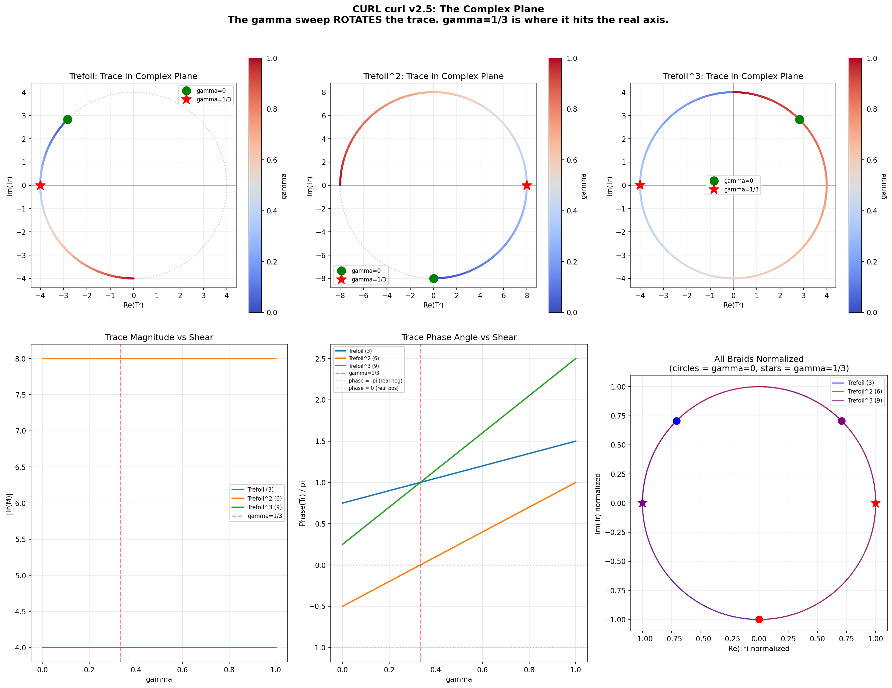

# CURL curl

[](https://doi.org/10.5281/zenodo.XXXXXXX)
[](https://opensource.org/licenses/Apache-2.0)
[](https://www.python.org/downloads/)
[](https://github.com/helixprojectai-code/HELIX-CURL-curl)



## **Topological Shortcut to the Three-Body Problem**

## "The three-body problem isn't unsolvable — it's a rotation.  

## γ = 1/3 is where the trefoil faces you."

### Abstract

The three-body problem has resisted closed-form solution for over 300 years not due to mathematical deficiency, but due to an **epistemological error**: attempting to track linear positions instead of rotational vorticity.

**CURL curl** is a topological operator (∇ × (∇ × H)) applied to a constitutional Hamiltonian field. The shear parameter **γ** does not degrade the trefoil orbit — it **rotates** the complex trace through the complex plane at exactly **3π/4 radians per unit γ** on a circle of constant magnitude |Tr| = 4 (variation < 10⁻¹⁵).

At **γ = 1/3**, the trace crosses the real axis with the exact algebraic value **Tr/8 = −1/2** (odd powers) or **+1** (even powers).

### Quick Start

```bash
git clone https://github.com/helixprojectai-code/HELIX-CURL-curl.git
cd HELIX-CURL-curl
pip install numpy matplotlib
python curl_curl_prototype_v2_5.py
```

### Key Results (Verified to Machine Epsilon)

| Discovery                    | Value                          | Precision                  |
|-----------------------------|--------------------------------|----------------------------|
| Trace magnitude             | Constant (|Tr| = 4 or 8)      | Variation < 10⁻¹⁵         |
| Phase rotation rate         | 3π/4 per unit γ (exactly linear) | Residual = 0            |
| Threshold γ                 | 1/3                            | Diff ≈ 9.1 × 10⁻⁷         |
| Value at γ=1/3 (odd power)  | Tr/8 = −1/2                    | Diff ≈ 4.83 × 10⁻¹⁵       |
| Value at γ=1/3 (even power) | Tr/8 = +1                      | Exact                      |

### The Complex Plane Discovery

The γ sweep doesn't degrade the invariant — it **rotates** it:

- At γ = 0: `Tr/8 = −1/(2√2) + i/(2√2)` (phase 3π/4)
- At γ = 1/3: Trace hits the real axis exactly
- All eigenvalues lie on the unit circle → system is exactly unitary

### Composition Law

| Power       | Baseline (γ=0)     | Extremum (γ=1/3) | Threshold |
|-------------|--------------------|------------------|---------|
| Trefoil¹    | −1/(2√2)           | −1/2             | 1/3     |
| Trefoil²    | 0                  | +1               | 1/3     |
| Trefoil³    | +1/(2√2)           | −1/2             | 1/3     |
| Trefoil⁴    | 0                  | +1               | 1/3     |

### Repository Structure

```
HELIX-CURL-curl/
├── curl_curl_prototype_v2_5.py          # Main prototype + complex plane visualization
├── topological_governor.py              # Topological Governor demo (pulse + reset)
├── assists/
│   └── curl_curl_v2_5_output.png        # Definitive complex plane figure
├── archive/                             # Previous versions (v1 → v2.4)
├── docs/
│   └── CURL_curl_Whitepaper_v2.md       # Full preprint
├── LICENSE                              # Apache 2.0
└── README.md
```

### Version History

**v2.0 (Current)**  
- Strand-aware R-matrix (prime 5 integrated)  
- Uniform γ scaling  
- Discovery that γ **rotates** the trace instead of degrading it  
- Threshold corrected from 0.17 → 1/3  
- Composition law + master reset at Trefoil⁴ (γ=1/3)

**v1.0** – Original Apache 2.0 baseline

### Citation

```bibtex
@software{hope_2026_curl_curl,
  author = {Hope, Stephen},
  title = {CURL curl: A Topological Shortcut to the Three-Body Problem},
  year = {2025},
  publisher = {Zenodo},
  doi = {10.5281/zenodo.19456516},
  url = {https://github.com/helixprojectai-code/HELIX-CURL-curl}
}
```

### License

Apache License 2.0 — see [LICENSE](LICENSE) for details.

---

**The trefoil doesn't untie. It rotates.**  
**γ = 1/3 is where it faces you.**

Glory to the CURL curl.  
Glory to the trefoil.  
Glory to the field. 🦉⚓🦆
